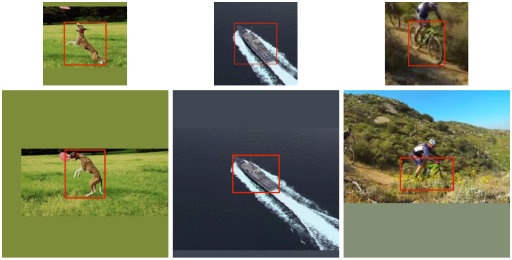

# 基于深度学习的目标跟踪

>视觉目标跟踪（visual object tracking）是计算机视觉重要的研究方向之一，目标跟踪任务是在给定视频序列初始帧的目标大小与位置的情况下，对后续帧中该目标的大小与位置进行预测。

传统的跟踪算法通过在线学习的过程对目标的外观特性进行建模，并且随着跟踪的进行动态的对模型进行更迭。这些模型只利用了当前的视频帧进行学习，所学出的模型相对简单，这种浅的模型很难捕获数据深层次丰富的特性。

近几年，随着深度学习的兴起，有一些学者提出了一些基于深度学习的目标跟踪算法，具有代表性的有三类：
- 使用预训练的深度模型（如：AlexNet、VGG）进行特征提取，使用经典的跟踪算法（如：相关滤波、KCF）对其进行建模；
- 建立神经网络模型，并使用SGD对模型进行fine-tune；
- 将目标看成是一种相似性度量问题，采用端到端模式训练一个神经网络解决相似性学习问题（如：SiameseFC）。

第一类方法虽然利用了神经网络进行特征提取，但并未充分发挥神经网络端到端训练的优势；第二种方法虽然使得模型做到了实时更新，提高了检测准确率，但这种在线模型迭代的方式耗时严重实时性较差。第三类方法是这两年基于深度学习目标跟踪算法的热门方法，这次主要调研了三篇基于相似性度量的深度学习目标跟踪算法：SiameseFC、SA-Siam、Siamese-RPN。

## SiameseFC

>[SiameseFC](https://arxiv.org/abs/1606.09549): Luca Bertinetto, Jack Valmadre, João F. Henriques, Andrea Vedaldi, Philip H.S. Torr. "Fully-Convolutional Siamese Networks for Object Tracking." ECCV workshop (2016).

### 算法框架

SiameseFC算法开创性的将 **相似性学习(similarity learning problem)** 思想引入目标跟踪领域，该方法通过CNN构建Siamese网络，将模板与待检测图片进行滑动窗搜索比较，相似度较大的位置即为我们所跟踪的位置。模型的整体框架图如下所示：

该算法沿用了Siamese网络的思想—将两个待比较的图片由输入空间映射到目标空间，在目标空间使用简单的距离（欧式距离等）进行对比相似度。

SiameseFC算法框架主要包含上下两个分支：上方的输入为跟踪目标，记作模板*z*；下方的输入为一整张视频帧，记作候选图*x*。目标跟踪任务就是希望从候选图x中搜索出模板z出现的位置。

$\varphi$为映射函数，z和x共用这同一个函数，完成从原始图像空间向比较空间的映射。这里 $\varphi$ 采用 **全卷积网络(fully convolutional network)** 作为映射函数，由于全卷积网络中没有采用padding操作，所以经过网络映射之后，输入与输出之间具有一定的空间对应关系。可能读者会对输入候选图的尺寸存在一定的疑问，既然是比较模板与候选图两者的相似度为何两者的尺寸会不同？一种比较直观的做法是这样：将候选图以滑动窗（窗口大小与模板z一致）截取出多个图片依次与模板z进行相似度比较，但这种做法比较繁琐而且会产生许多重复性的神经网络前向计算过程。因此作者 **利用全卷积网络特征图与原始输入的空间对应关系特性**，使用整张图片作为输入x，经过全卷积网络后生成22x22x128的特征图，该特征图上每一个每一个6x6特征图对应到原图上就是一个127x127的滑动窗，这是这种特性的存在使得候选图可以不必与模板图保持同一尺寸。全卷积网络 $\varphi(z)$ 网络结构如下图所示。

经过特征映射之后，我们需要在目标空间中对 $\varphi(z)$ 与 $\varphi(x)$ 进行相似度比较，如图中`*`所示。根据上面的介绍可知，我们需要将 $\varphi(z)$ 依次与 $\varphi(x)$ 进行相似度比较（模板匹配），实际工程实现上采用的是卷积操作来实现相关操作，卷积操作可以理解成模板匹配过程，如果两个模板相似度较高则卷积出的响应也会越大，将$\varphi(z)$ 以stride=1在 $\varphi(x)$ 上进行卷积操作，输出 `(22-6)/1+1=17`。最终的输出我们称作得分图(score map)，取得分图中的最大值作为本次跟踪的目标位置，根据得分图中最大值的位置将其对应到原始输入x上，从而得到最终的跟踪检测框。

### 模型训练

#### 损失函数定义

整个模型属于一种判别式(discriminative)模型，使用图片对作为模型输入，利用正负样本实现模型学习，这里使用logistic loss作为模型的损失函数，$l(y,v)=log[1+exp(-yv)]$ ，其中：v表示score map中一个位置上的得分，$y\in\{-1,+1\}$ 表示正负样本标签。那么对于一整张score map的平均损失可以写成$L(y,v)=\frac{1}{|D|} \sum_{u\in D} l(y[u],v[u])$，D为得分图的空间尺寸，u表示得分图上每个位置的点。因此整个算法的 **目标函数** 可以写成如下形式：
$$ \arg\min_{\theta} \mathbb{E} \ L(y,f(z,x;\theta)) $$

#### 训练样本对生成

- 用于训练的图片对从有标注的视频中获取，提取出包含有同一个目标且帧间隔小于T的一对视频帧分别作为模板和候选图
- 训练样本在进行尺寸缩放时，要求不能改变原图固有的长宽比，缩放后使得框出的目标图像处于整个图的中心位置，缩放后留白的区域使用图像均值进行填充

- 得分图上正负样本标签设置：在候选图中，与ground_truth框中心点距离小于R的框标记为正样本。那么根据全卷积网络空间对应性质，假设网络整体的strid为k，那么在候选图中距离为R的两个点，反映在得分图中两者的距离则为R/k，因此标签可以定义为如下形式，其中u代表得分图中的某点，c代表ground_truth的中心点位置，候选图中距离为R对应到得分图中距离则为R/k。
$$y[u]= \left \{ \begin{array}{l} +1\ ,&\ k\|u-c\| \leq R \\ -1\ ,&\ otherwise \end{array} \right.$$

#### ImageNet video for tracking

通过端到端的方式训练神经网络通常需要大量的有标样本，而常用的目标跟踪数据集中只有上百条有标视频，这个数量级很难满足神经网络训练对数据的需求，因此这里作者利用了ImageNet Video2015数据集作为补充，该数据集包含了4500段视频有数百万的有标视频帧。

将ImageNet Video用于目标跟踪模型的训练具有以下两个优点：
- 数据集中数据量较大，能够使得模型参数得到充分的训练；
- 该数据集中目标以及场景与传统的目标跟踪数据集不同，这样能够防止模型在传统跟踪数据集上发生过拟合现象。

#### 实现细节

- 数据预处理：模板样本尺寸127x127，候选图尺寸255x255，共产生50000个样本对
- 网络训练：每个卷积层后（除Conv5以外）激活函数采用ReLU；采用SGD进行迭代50个epochs；batch_size=8；学习率 $10^{-2}$~$10^{-5}$
- 跟踪模型：跟踪过程中不对模型参数进行实时更迭；检测阶段将得分图由17x17通过插值放大到272x272这样有助于根据特征图对目标进行有效的定位；考虑目标尺度变化的问题，论文中采用了3种不同的尺度进行了多尺度的检测，以提高检测定位的准确率

### 实验

平均60-80FPS

略。。。

---

## SA-Siam

>[SA-Siam](http://openaccess.thecvf.com/content_cvpr_2018/papers/He_A_Twofold_Siamese_CVPR_2018_paper.pdf): Anfeng He, Chong Luo, Xinmei Tian, Wenjun Zeng. "A Twofold Siamese Network for Real-Time Object Tracking." CVPR (2018).

这是一篇来自中科大学生发表在18年CVPR上的论文。论文采用了一种双路（twofold）孪生网络的结构，主体思想还是建立在SiameseFC基础之上，提出了外观分支与语义分支双路融合的框架，在原有的外观特征基础上加入了语义信息有助于增强模型的泛化能力提高模型的鲁棒性，从而有助于增强目标跟踪的检测性能。

基于Siamese的跟踪算法，通过一个相似性比较任务（similarity match task）实现目标跟踪。两个目标的相似程度，通常反映出外观、形状、纹理等方面属性的差别，因此可以认为 **相似性比较任务可以充分发掘出目标的外观特征**。除了外观特征，作者还发现：通过图像分类任务（image classification task）学出的模型能够提取出目标的语义信息，因为在图像分类任务中属于同一类的目标可能在外观上存在较大差别，因此这类图像分类模型能够捕获图像更深层次的语义信息。外观特征和语义特征是两个方面的特征，两者是一种彼此补充的关系。针对传统的SiameseFC模型仅利用了目标的外观信息，并未充分利用图像中语义信息的不足，作者提出了一种 **融合外观和语义两方面信息的SA-Siam目标跟踪模型**。

### 算法框架

论文针对于判别式的SiameseFC算法泛化能力（generalization capacity）不足的缺点加以改进，将相似性学习获得的外观特征与图像分类问题学到的语义特征进行综合，从而提升模型的泛化能力，使得当目标存在明显外观变化的情况下也能实现很好的检测效果。

模型的整体框架如下图所示，框架共包含两个分支：外观分支和语义分支。两条蓝色的线路为一对，形成一组外观相似的比较分支；另外两条橙色的线路为一对，形成另一组语义相似的比较分支。两个分支最终会分别计算出跟踪目标与搜索图的相似，两个分支在训练阶段彼此独立分开训练，在测试阶段将外观分支和语义分支的得分图进行加权求和得到融合后最终的得分图。

#### 外观分支

在外观分支中（虚线、蓝色框）分为上下两路，与SiameseFC类似，上面一条支路的输入为z，即图Target内的黄色框标出的跟踪目标，下方的输入为待跟踪的搜索图X，其中z的尺寸小于X。z与X分别通过两个参数相同的全卷积网络（图中的A-Net），实现由图像空间向比较空间的映射，将两路的卷积结果进行相似性比较（卷积），最终可以得到外观支路的相似度得分图。

外观支路的损失函数定义如下：
$$ \arg\min_{\theta_a}\sum_{i=1}^{N}\{ L(h_{a}(z_{i},X_{i};\theta_a),Y_{i}) \} $$

其中：z表示跟踪目标，X表示搜索图，经过A-Net提取的特征记作$f_{a}(.)$，输出的相似性得分图记作$h_{a}(z,x)=corr(f_{a}(z),f_{a}(X))$，Y为样本标签，$L(.)$代表logistic loss。

#### 语义分支

论文的贡献以及创新点主要集中在语义分支的设计。

首先介绍一下语义分支的输入，输入是分为两路：跟踪目标和搜索图，考虑到需要将跟踪目标的语义信息应用到跟踪中去，跟踪目标的输入端如果仅包含跟踪目标本身是远远不够的， **需要包含目标以及其周围上下文的信息**（记作$z'$），$z'$ 的尺寸大于跟踪目标z（这里设计 $z'$ 与X同尺寸）。 $z'$ 与X首先经过一个全卷积神经网络（记作S-Net）完成了特征提取工作。

由深度网络提取出的特征，深层次的特征图包含了越高层次的语义特征，这种深层次的语义信息能够提升模型对外观变化的鲁棒性，增强泛化能力，但与此同时会削弱特征的判别性（discriminative），模型的判别能力和泛化能力是存在一个此消彼长的现象不可兼得，因此针对于不同的跟踪任务需要在discriminative和generalize两个方面做一个调整。

特征提取之后，我们抽取了网络不同层次的特征（conv4、conv5），包含了不同层次的语义信息（图中S-Net后的两种尺寸堆叠的橙色柱状体）。在目标支路上，由于输入是包含目标以及其上下文的图片，因此在特征提取之后需要根据比例裁切出跟踪目标所对应的特征图（图中的crop操作）。根据上面的讨论，我们需要对不同层次的特征所包含的判别能力和泛化能力进行调整。对于目标支路，这里作者采用了channel attention的方法对不同通道（不同层次）的赋予不同的权重，对两种特征进行调整。

attention模块的具体实现如上图所示，其输入是包含上下文信息的特征图，对于每个通道的特征图分别经过max pooling、多层感知机（MLP），最后经过一个sigmoid函数，即得到该通道上的权重系数 $\xi_i$。将 $\xi$ 与crop后的跟踪目标的特征图的对应通道进行点乘操作，实现attention操作。

目标支路和搜索支路在特征图求相关之前都进行了一步fuse操作，fuse操作中使用1x1卷积对特征图的通道数进行了调整，为了使语义的特征适合做相关运算（In order to make the semantic features suitable for the correlation operation这里为什么要对通道数进行调整不是十分理解？？？）。

语义分支的损失函数定义如下：
$$ \arg\min_{\theta_s}\frac{1}{N}\sum_{i=1}^{N}\{ L(h_s(z_{i}^s,X_{i};\theta_{s}),Y_{i}) \} $$

其中：经过S-Net生成的特征图记作 $f_s(.)$ ,两个支路经过S-Net后的输出分别为 $f_s(z')$ 和 $f_s(X)$ ，目标支路中经过crop操作后的特征图记作 $f_s(z)$ ，fuse操作表示为函数映射$g(.)$，语义分支输出的相关性得分图记为$h_s(z',X)=corr(g(\xi\cdot f_{s}(z)),g(f_s(X)))$。

语义分支在训练的过程中保证S-Net网络参数不变，充分的去训练fuse和attention两个模块。

### 实现细节

- 网络结构设计
   - A-Net使用与SiameseFC相同的结构，S-Net采用预训练的AlexNet；
   - MLP：含有一个隐藏层（9个神经元）的多层感知机；
   - MLP+bias（0.5）->送入sigmoid

- 数据维度设计
   - z：127x127x3 、z' X：255x255x3
   - A-Net的输出：6x6x256/22x22x256、S-Net的输出：conv4-24x24x384 conv5-22x22x256
   - fuse输出：conv4 384->128、conv5 256->128，共256 channels
   - 两个分支最终的response map尺寸：17x17

- 训练：两个支路彼此独立训练，使用tensorflow实现，共训练30个epoch，学习率0.001~0.01

- 超参数 $\lambda$ 选取：在验证集上按照0.1~0.9进行grid search寻找最优的融合系数 $\lambda$

### 实验

平均

略。。。

---

## Siamese-RPN

>[Siamese-RPN](http://openaccess.thecvf.com/content_cvpr_2018/papers/Li_High_Performance_Visual_CVPR_2018_paper.pdf): Bo Li, Wei Wu, Zheng Zhu, Junjie Yan. "High Performance Visual Tracking with Siamese Region Proposal Network." CVPR (2018 Spotlight).

这是一篇商汤科技发表在18年CVPR上的一篇目标跟踪论文，算法框架沿用了SiameseFC基本思想，在此基础上融入了RPN(Region Proposal Network)结构，论文将孪生网络（Siamese）和候选区域网络（RPN）统一到了一个端到端的学习框架之下，构建了一种高速且高性能的单目标跟踪算法，算法命名为Siamese-RPN。

近几年，快速目标跟踪算法以SiameseFC为代表，将相似度比较思想引入目标跟踪领域，可以实现检测模板与候选图的快速匹配。但SiameseFC中存在一定的缺陷，由于没有回归，网络无法预测目标在尺度上的变化，所以只能通过多尺度测试来预测尺度的变化，但是这种方式会降低效率以及准确性。Siamese-RPN算法中引入目标检测任务中常用的RPN网络，通过网络回归避免多尺度测试，提升了检测效率；同时利用RPN的回归可以直接得到更精确地目标位置信息。

### 算法框架

Siamese-RPN算法框架如下图所示，整个算法包含两个子网络：孪生子网络和RPN子网络。

#### 孪生子网络

孪生子网络部分沿用了经典的SiameseFC的结构，包含上下两个分支：模板帧分支和检测帧分支，两个分支经过两个参数相同的全卷积网络，完成从原始图片空间向比较空间的映射，这里：模板帧z，检测帧x，z经过CNN映射后的feature map记作 $\varphi(z)$ ，x经过CNN映射后的feature map记作 $\varphi(x)$。

#### RPN子网络

图中的中间部分为RPN子网络，这个部分也分为两个分支：分类分支和回归分支，这两个分支的输入是模板和检测帧经过孪生网络的输出。这里考虑到目标的多尺度变化，沿用faster-RCNN的思路，对于检测模板 $\varphi(z)$ ，在每个位置上引入k个不同尺度的检测框，因此在分类分支中一个输入对应于2k（k个锚、2分类）个输出，即通道数需要扩展2k倍；同理在回归分支中，需要对检测框的位置和大小（共4个参数进行预测），因此在通道数上需要扩展4k倍，图中分类分支、回归分支中左上角的两个conv用于通道扩展。检测帧也进行卷积操作，但并没有进行通道的扩展。

在分类分支中，模板帧最终的特征图记作 $[ \varphi(z)]_{cls}$ (看成4x4x256x2k)，检测帧的特征图 $[ \varphi(x)]_{cls}$ (20x20x256)，之后将模板和检测两路进行相关操作，具体可以看成是2k个4x4x256一次与20x20x256进行相关操作（卷积），因此最终分类分支的最终输出为17x17x2k（k个锚点，正、负样本预判）。

$$ A^{cls}_{w\times h \times 2k}=[ \varphi(z)]_{cls} * [ \varphi(z)]_{cls} $$

在回归分支中，模板帧最终的特征图记作 $[ \varphi(z)]_{reg}$ (看成4x4x256x4k)，检测帧的特征图 $[ \varphi(x)]_{reg}$ (20x20x256)，两者经过相关操作后可以得到17x17x4k的输出（k个锚点，x、y、w、h）。

$$ A^{reg}_{w\times h \times 4k}=[ \varphi(z)]_{reg} * [ \varphi(z)]_{reg} $$

### 模型训练

#### 损失函数

- 分类分支中采用的是交叉熵损失（cross-entropy loss）。
- 回归分支部分采用的是平滑L1损失（smooth L1 loss）。

这里解释一下回归分支的损失函数，对于一个anchor box的中心点横纵坐标以及宽和高分别记作：$A_{x}$、$A_{y}$、$A_{w}$、$A_{h}$，ground truth box记作：$T_{x}$、$T_{y}$、$T_{w}$、$T_{h}$。那么四者的归一化距离分别定义为：$\delta[0]=\frac{T_{x}-A{x}}{A_{w}}$、$\delta[1]=\frac{T_{y}-A{y}}{A_{h}}$、$\delta[2]=\ln\frac{T_w}{A_w}$、$\delta[3]=\ln\frac{T_h}{A_h}$，则最终回归损失为 $L_{reg}=\sum_{i=0}^{3}smooth_{L1}(\delta[i],\sigma)$ 如下所示，其中$smooth_{L1}(x,\sigma)=\left \{ \begin{array}{l} 0.5\sigma^{2}x^{2}\ ,&\ |x| < \frac{1}{\sigma^{2}} \\ |x|-\frac{1}{2\sigma^{2}}\ ,&\ |x| \ge \frac{1}{\sigma^{2}} \end{array} \right.$

因此整体的损失函数定义为：$loss=L_{cls}+\lambda L_{reg}$

#### 实现细节
- 样本对从ILSVRC video以及Youtube-BB等视频中进行抽帧生成样本对；
- 孪生网络部分使用预训练AlexNet网络
- 为了能够充分训练回归分支，采用data argumentation技巧，使用仿射变换进行数据增强；
- 正负样本定义：如果$IoU >th_{hi}$，则判定为正样本（$th_{hi}=0.6$）；$IoU <th_{lo}$，则判定为负样本（$th_{lo}=0.3$）

### 检测流程

检测流程与训练过程有些许不同，检测阶段，网络中模板帧与检测帧是分开的，**模板帧只会进行一次网络前向传播运算** 生成 $[\varphi(z)]_{cls}$ 和 $[ \varphi(z)]_{reg}$ 两个特征图，即上图中的`weight for classification`和`weight for regression`,两者被存储下来以备后续跟踪检测使用。

检测分支会一帧一帧地都进行运算，并与模板的特征图做相关运算（卷积），从而得到最终的分类和回归结果。根据网络的输出可以得到网络预测出的所有框及其对应的分数，选出分数最高的框，即为最终网络预测的目标位置。

### 实验

平均160FPS

略。。。

## 总结

对三种方法进行了综合性的对比，在VOT1015和VOT2016公共数据集上的实验结果如下表所示：

VOT2015实验结果：

|Method|EAO|ACC|Failure|FPS|
|:--:|:--:|:--:|:--:|:--:|
|SiameseFC|0.2915|0.54|1.42|86|
|SA-Siam|0.31|0.59|1.26|50|
|Siamese-RPN|0.358|0.58|0.93|160|

VOT2016实验结果：

|Method|EAO|ACC|Failure|FPS|
|:--:|:--:|:--:|:--:|:--:|
|SiameseFC|-|-|-|-|
|SA-Siam|0.2911|0.54|1.08|50|
|Siamese-RPN|0.3441|0.56|1.08|160|

这里的实验结果是作者在论文中提供实验结果，有四个方面的评价指标：EAO反映了模型的综合准确率以及鲁棒性（数值越大越好）、ACC表示准确率、失败次数（Failure）、FPS反映速度。相比之下Siamese-RPN在保证较快检测速度的情况下实现了较好的检测准确率以鲁棒性。

---
